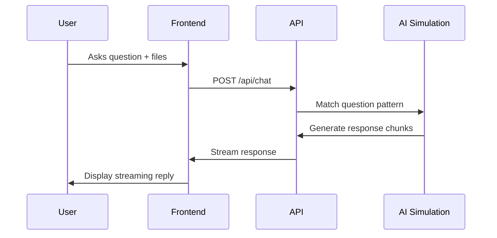

# Tax Assistant Chatbot

A Next.js-based AI chatbot that helps users with basic tax-related questions (Form 1040) featuring multimedia responses and document analysis simulation.

## Features

- **AI-Powered Tax Q&A**  
  Get instant answers about W-2 forms, deductions, tax brackets, and more
- **Document Analysis Simulation**  
  Upload W-2s or other tax documents (PDF/Images) with mock processing
- **Interactive Multimedia Responses**  
  Structured data displays with dynamic tables and processing animations
- **Conversational Interface**  
  Natural chat flow with follow-up suggestions and response streaming
- **Tax-Specific Knowledge**  
  Pre-built responses for 10+ common tax topics including:
  - Standard deductions
  - Filing statuses
  - Retirement contributions
  - Capital gains taxes
  - Audit risks

## Tech Stack

- **Frontend**: Next.js 14 (App Router)
- **AI Integration**: Vercel AI SDK (`useChat`)
- **Styling**: Tailwind CSS + Lucide icons
- **State Management**: React State
- **Type Safety**: TypeScript

## Installation

1. Clone repository:

```bash
git clone [your-repo-url]
cd tax-assistant
```

2. Install dependencies:

```bash
npm install
```

3. Run development server:

```bash
npm run dev
```

Visit `http://localhost:3000` in your browser.

## Usage

1. **Ask Tax Questions**
   Try these examples:

   - "Explain standard deductions"
   - "How do tax brackets work?"
   - "What's the child tax credit?"

2. **Upload Documents**
   Click the paperclip icon to attach:

   - W-2 forms (PDF/JPEG/PNG)
   - 1099 documents
   - Tax receipts

3. **Interactive Responses**
   Look for:
   - Streaming answers
   - Animated processing indicators
   - Structured data tables
   - Follow-up question suggestions

## Implementation Details

### Key Components

- `app/api/chat/route.ts`: Simulated AI processing with:
  - Dynamic response selection
  - Mock document analysis
  - Structured data streaming
- `app/page.tsx`: Main chat interface with:
  - Response stream handling
  - Message state management
  - UI event handling
- `components/chat-window`: Renders:
  - Message bubbles
  - Processing animations
  - Structured data tables
- `components/chat-input`: Handles:
  - User input
  - File uploads
  - Message submission

### Simulated AI Flow



## Assumptions & Limitations

- **Frontend-Only Simulation**
  No actual AI/ML model integration - responses are pattern-matched
- **Document Processing**
  File analysis is mocked with 2-3 second delays
- **Tax Accuracy**
  Uses 2023-2024 tax figures - consult a professional for real filings
- **Security**
  Uploaded files are not stored or processed

## Future Improvements

1. **Backend Integration**

   - Add real AI tax analysis (OpenAI/Gemini)
   - Implement PDF text extraction
   - Add user authentication

2. **Enhanced Features**

   - Tax calculator integration
   - Filing status wizard
   - Deduction optimization tips

3. **UI Upgrades**
   - Interactive tax forms
   - Data visualization charts
   - Conversation history

## Placeholder Functionality

| Feature             | Current Implementation    | Potential Expansion              |
| ------------------- | ------------------------- | -------------------------------- |
| File Analysis       | Mock processing animation | AWS Textract/OCR integration     |
| AI Responses        | Pattern matching          | LLM fine-tuning on tax documents |
| Data Visualization  | Simple tables             | Interactive charts/diagrams      |
| User Authentication | None                      | Auth.js integration              |

---

**Disclaimer**: This is a demo application - do not use for actual tax preparation. Always consult a qualified tax professional.
